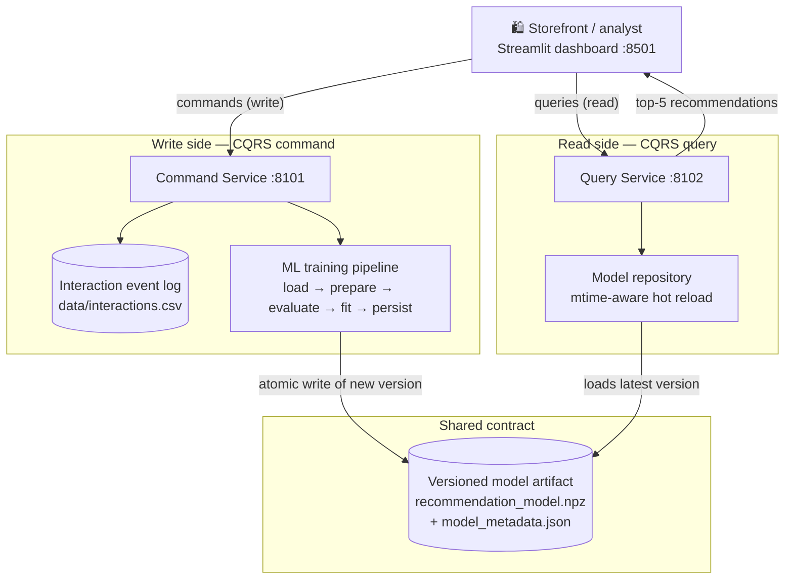

# 🛒 E-commerce Recommendation — a CQRS + ML reference build

> **AIMLCZG546 · Software Engineering for Machine Learning · Assignment I · Group 049**

[](https://github.com/sumanthtps/seml-ecommerce-reco/actions/workflows/ci.yml)


This repository is the **single source of truth** for the assignment. Rather than a
notebook that trains a model and stops, it treats the recommender the way you'd treat
a production feature: two independently deployable services split along **read/write
lines (CQRS)**, an immutable and versioned model artifact between them, an interactive
operator dashboard on top, and the tests, type checks, CI, and container packaging that
let someone else reproduce the whole thing from a clean checkout.

If you only want to *see it work*, jump to [Quick start](#-quick-start). If you're
reviewing the design, start with [Why two services](#-why-two-services-cqrs) and
[How the recommender works](#-how-the-recommender-works).

---

## 📑 Contents

- [The 60-second tour](#-the-60-second-tour)
- [Why two services (CQRS)](#-why-two-services-cqrs)
- [Architecture at a glance](#-architecture-at-a-glance)
- [How the recommender works](#-how-the-recommender-works)
- [Quick start](#-quick-start)
- [Driving the dashboard](#-driving-the-dashboard)
- [API reference](#-api-reference)
- [Quality gate](#-quality-gate)
- [Running it in containers](#-running-it-in-containers)
- [Repository layout](#-repository-layout)
- [Regenerating the submission artifacts](#-regenerating-the-submission-artifacts)
- [Team & submission](#-team--submission)

---

## ⚡ The 60-second tour

| You want to… | Command |
| --- | --- |
| Install everything | `make install` |
| Generate the demo dataset | `make seed` |
| Train + evaluate the model | `make train` |
| Run the write service | `make command` |
| Run the read service | `make query` |
| Open the dashboard | `make ui` |
| Prove it end-to-end (starts + stops both services) | `make verify` |
| Run the full local CI gate | `make check` |

Everything below is just these building blocks in more detail. `make help` prints the
full menu at any time.

---

## 🧭 Why two services (CQRS)

**Command Query Responsibility Segregation** means we stop pretending that *recording a
customer action* and *asking for recommendations* are the same kind of workload. They
aren't:

- **Writes** (record an interaction, add a user, retrain) are infrequent, need
  validation and durability, and are allowed to be slow — training can take seconds.
- **Reads** (top-*k* recommendations) are the hot path: frequent, latency-sensitive,
  and should never be blocked by a training job or a bad write.

So we split them into two processes that share nothing but a file contract:

| | **Command service** `:8101` | **Query service** `:8102` |
| --- | --- | --- |
| Responsibility | Owns the event log + trains the model | Serves recommendations from the trained model |
| CQRS role | Write side | Read side |
| Touches training data? | Appends to it | Never writes it |
| Produces | A new versioned model artifact | Ranked products, catalog, user, and activity reads |
| Can it be scaled independently? | Yes | Yes — and this is the one you'd scale out |

The two never call each other. The **only** thing that crosses the boundary is an
**immutable, versioned model artifact** on disk. The command side writes a new version;
the read side notices the file changed and hot-swaps it in — no restart, no shared
in-memory state, no chance of a half-trained model being served. That decoupling is the
whole point of the pattern, and the test suite enforces it: the query service has **no
write routes**, and a `POST` to it returns `404`.

---

## 🏗️ Architecture at a glance



The dashboard is a pure client of the two HTTP APIs — it never reads the CSV or the
`.npz` file directly. That keeps the CQRS boundary honest all the way up to the UI: if
the dashboard can do it, so can any other consumer.

<details>
<summary><strong>Design decisions worth calling out</strong> (click to expand)</summary>

- **Immutable, content-addressed versions.** Each model's version is a SHA-256 hash of
  the interaction matrix and its user/item labels (first 12 hex chars). Same data in →
  same version out. It makes runs reproducible and makes "did the model actually change?"
  a trivial string comparison.
- **Atomic artifact writes.** Training writes to a temp file and `os.replace()`s it into
  place, so a reader never observes a partially written model even if training crashes
  mid-write.
- **Hot reload without coordination.** The query side caches the model and only reloads
  when the metadata file's mtime changes. No message bus, no restart hook — the file
  *is* the notification.
- **No pickle.** The artifact is a `numpy` `.npz` loaded with `allow_pickle=False`, and
  metadata is plain JSON. Loading an untrusted model can't execute code, and the loader
  refuses to serve a model whose metadata version doesn't match the arrays.
- **Injectable paths.** Both services are built by a `create_app(...)` factory that takes
  data/users/artifact paths, which is exactly why the integration tests can spin up real
  `TestClient`s against throwaway temp directories.
- **Single-flight training.** A non-blocking lock rejects a concurrent retrain with
  `409` instead of corrupting the event log.

</details>

---

## 🤖 How the recommender works

The model is **item-based collaborative filtering** — "customers who engaged with this
also engaged with that." It's a deliberate choice for the assignment: it's interpretable,
needs no labels, and its behaviour is easy to reason about and test.

**1. Implicit feedback → weighted signal.** There are no star ratings, so we treat
different actions as different strengths of intent:

| Action | Weight | Reading |
| --- | --- | --- |
| `view` | 1.0 | mild interest |
| `click` | 2.0 | deliberate attention |
| `cart` | 3.0 | strong intent |
| `purchase` | 5.0 | committed |

**2. Prepare.** Raw events are validated, de-duplicated by `event_id`, and aggregated
into a dense user × item matrix of summed action weights.

**3. Fit.** We compute **cosine similarity between item columns**, zero the diagonal (an
item shouldn't recommend itself), and keep the matrix as the servable model.

**4. Recommend.** A user's interaction vector is multiplied by the item-item similarity
matrix to score every product; anything the user has already engaged with is masked out,
and the top *k* unseen items are returned, ranked.

**5. Cold start.** A brand-new user has no history, so collaborative filtering has nothing
to work with. Instead of returning nothing, the query service falls back to the user's
declared **interest category** and returns top products from it, tagging the response
`strategy = "interest-based-cold-start"` so the caller knows which path fired.

### Offline evaluation

Training runs a **leakage-safe leave-N-out** check: for each user it hides *N* known
interactions (default 2), refits on the remainder, and measures how many hidden items
resurface in the top *k*. The metrics below come from the model artifact currently
committed in `artifacts/`:

| Metric @k=5 | Value | What it tells you |
| --- | --- | --- |
| **Precision@5** | `0.31` | share of recommended slots that were genuinely relevant |
| **Recall@5** | `0.77` | share of held-out items successfully recovered |
| **Hit-rate@5** | `0.94` | fraction of users who got at least one good hit |
| **Coverage@5** | `1.00` | fraction of the catalog the model is willing to surface |

> These are strong numbers *because* the demo data is deliberately clustered (users shop
> within and adjacent to a preference cluster) — the point is to exercise the full
> pipeline and evaluation harness end-to-end, not to claim production accuracy on real
> traffic.

---

## 🚀 Quick start

**Prerequisites:** Python **3.11+** (3.11 and 3.12 are both tested in CI).

```bash
# 1. Environment + dependencies
python -m venv .venv
source .venv/bin/activate            # Windows: .venv\Scripts\activate
python -m pip install --upgrade pip
python -m pip install -r requirements.txt -e ".[dev,report]"

# 2. Generate data and train the first model
python scripts/seed_data.py          # deterministic interactions.csv + users.csv
python scripts/train_and_evaluate.py # trains, evaluates, writes artifacts/
```

Then bring up the three processes, one per terminal:

```bash
# Terminal 1 — write side
uvicorn ecom_ml.command_service.main:app --port 8101

# Terminal 2 — read side
uvicorn ecom_ml.query_service.main:app --port 8102

# Terminal 3 — dashboard
streamlit run frontend/app.py --server.port 8501
```

Open **<http://127.0.0.1:8501>**. The equivalents are `make command`, `make query`, and
`make ui`.

### Prefer a single command?

`scripts/verify_live.py` (or `make verify`) seeds data, trains, starts **both** services,
runs a real HTTP command-and-query demo against them, writes a transcript to `evidence/`,
asserts it got 5 recommendations back, and then shuts everything down cleanly. It's the
fastest way to confirm a fresh checkout is healthy — and it's what you run before trusting
anything else.

```bash
python scripts/verify_live.py
```

---

## 🎛️ Driving the dashboard

The Streamlit "Recommendation Control Room" is organised around the four things an
operator actually does. The sidebar shows live health for both backends and links to
their `/docs`.

| Tab | What it does | CQRS side |
| --- | --- | --- |
| ✨ **Recommend** | Pick a customer, get ranked products, and see their last 3 actions | Read (query) |
| ➕ **Record interaction** | Log a `view` / `click` / `cart` / `purchase` event | Write (command) |
| 👥 **Users** | Browse named profiles and add a new one with an interest | Write (command) |
| ↻ **Train model** | Re-run the five-stage pipeline and see the fresh summary | Write (command) |

A useful thing to try: record a few interactions for a customer, retrain from the **Train
model** tab, then go back to **Recommend** — the header will show a new model version and
the rankings will reflect what you just logged. That round trip is the whole system in one
gesture.

The seeded database ships with five named users so demos are immediately relatable:

| User | Interest |
| --- | --- |
| Shreyas | Electronics |
| Sumanth | Home & Kitchen |
| Ravi | Fashion |
| Vivek | Personal Care |
| Nishant | Fitness & Lifestyle |

...against a synthetic catalog of **60 products across 5 categories**.

---

## 🔌 API reference

Interactive OpenAPI docs are generated automatically:
**Command → <http://127.0.0.1:8101/docs>**, **Query → <http://127.0.0.1:8102/docs>**.

### Command service `:8101` — write side

| Method | Path | Purpose |
| --- | --- | --- |
| `GET` | `/health` | Liveness + CQRS role |
| `POST` | `/commands/interactions` | Append one validated interaction → `202 Accepted` |
| `POST` | `/commands/users` | Create a named profile → `201 Created` |
| `POST` | `/commands/train` | Evaluate + train + persist a new model version |

### Query service `:8102` — read side

| Method | Path | Purpose |
| --- | --- | --- |
| `GET` | `/health` | Liveness + currently loaded model version |
| `GET` | `/queries/recommendations?user_id=&k=` | Top-*k* products (CF or cold-start) |
| `GET` | `/queries/model-info` | Metadata + evaluation metrics for the live model |
| `GET` | `/queries/products` | Full product catalog |
| `GET` | `/queries/users` | Named user profiles |
| `GET` | `/queries/recent-actions?user_id=&limit=` | A customer's most recent activity |

<details>
<summary><strong>Try it from the terminal</strong> (click to expand)</summary>

```bash
# Record a purchase
curl -X POST http://127.0.0.1:8101/commands/interactions \
  -H "Content-Type: application/json" \
  -d '{"user_id":"u003","item_id":"P025","action":"purchase"}'

# Retrain
curl -X POST http://127.0.0.1:8101/commands/train \
  -H "Content-Type: application/json" -d '{"k":5,"holdout_per_user":2}'

# Ask for recommendations
curl "http://127.0.0.1:8102/queries/recommendations?user_id=u003&k=5"
```

</details>

---

## ✅ Quality gate

The bar this repo holds itself to — all of it runs in CI on Python 3.11 **and** 3.12, and
you can run the identical gate locally with `make check`:

```bash
ruff check backend frontend scripts tools          # lint
ruff format --check backend frontend scripts tools # formatting
mypy                                               # strict static types
pytest --cov=ecom_ml --cov-report=term-missing     # tests + branch coverage
```

- **Types are strict.** `mypy` runs with `disallow_untyped_defs`, `no_implicit_optional`,
  and `warn_unused_ignores`; the whole codebase is annotated.
- **Tests cover both halves.** Five tests exercise the ML lifecycle (loading,
  de-duplication, unseen-only ranking, bounded metrics, artifact round-trip) and three
  drive the services through a real `TestClient` — including the assertion that the read
  side rejects writes and that cold-start returns interest-matched products.
- **`pre-commit`** wires ruff (with `--fix`) and format plus the usual hygiene hooks;
  the `docker` CI job additionally builds the runtime image so the container never rots.

---

## 🐳 Running it in containers

`docker-compose.yml` defines all three services with health checks and correct startup
ordering (the query service waits for the command service to be healthy; the UI waits for
both):

```bash
make up      # docker compose up --build
make logs    # follow logs
make down    # stop the stack
```

The image is also **Hugging Face Spaces–ready**: the front matter at the top of this file
plus `start.sh` (which launches both APIs and the Streamlit UI behind port `7860`) let the
whole thing deploy as a single Docker Space.

---

## 🗂️ Repository layout

```text
backend/src/ecom_ml/
├── command_service/     FastAPI write side (interactions, users, training)
├── query_service/       FastAPI read side (recommendations, catalog, activity)
├── ml/                  data · model · evaluation · pipeline · artifact I/O
├── api_models.py        Pydantic request/response contracts shared by both services
├── catalog.py           synthetic 60-product catalog
├── users.py             named profiles + cold-start interests
└── config.py            environment-driven paths

backend/tests/           ML lifecycle + CQRS service tests
frontend/app.py          Streamlit "Control Room" dashboard
scripts/                 seed · train_and_evaluate · run_demo · verify_live
tools/                   generators for the diagrams, notebook, and Word report
data/                    deterministic interactions.csv + users.csv
artifacts/               committed model (.npz) + metadata (.json)
```

**Generated, not committed** — these appear only after you run the relevant command, and
are intentionally kept out of version control:

- `evidence/` — HTTP transcript and service logs, produced by `scripts/verify_live.py`.
- `final_submission/` — the executed notebook and Word report, produced by the `tools/`
  generators.

---

## 📦 Regenerating the submission artifacts

The report, notebook, and diagrams are all reproducible from source — nothing is
hand-edited:

```bash
python scripts/verify_live.py     # fresh evidence (transcript + logs)
python tools/generate_assets.py   # architecture diagrams + metrics figure
python tools/build_report.py      # Word report  (add --with-pdf for a PDF too)
python tools/build_notebook.py    # executed notebook with saved outputs
```

`make report` chains the diagram, notebook, report, and PDF steps in one go.

---

## 🎓 Team & submission

**Group 049 — AIMLCZG546, Software Engineering for Machine Learning, Assignment I.**

Contribution split and member IDs live in `submission_details.json`. When the portal asks
for a notebook and a report, only the two generated files are submitted:

- `final_submission/G049.ipynb`
- `final_submission/G049_SEML_Assignment_01_Complete_Report.docx`

Everything else in this repository exists so that a reviewer can regenerate those two
files — and watch the system run — from a clean clone.

> ⚠️ **Before submitting:** fill in every `TO_FILL` field in `submission_details.json`
> (member names, BITS IDs), then regenerate the report and notebook so they carry the
> final details.
